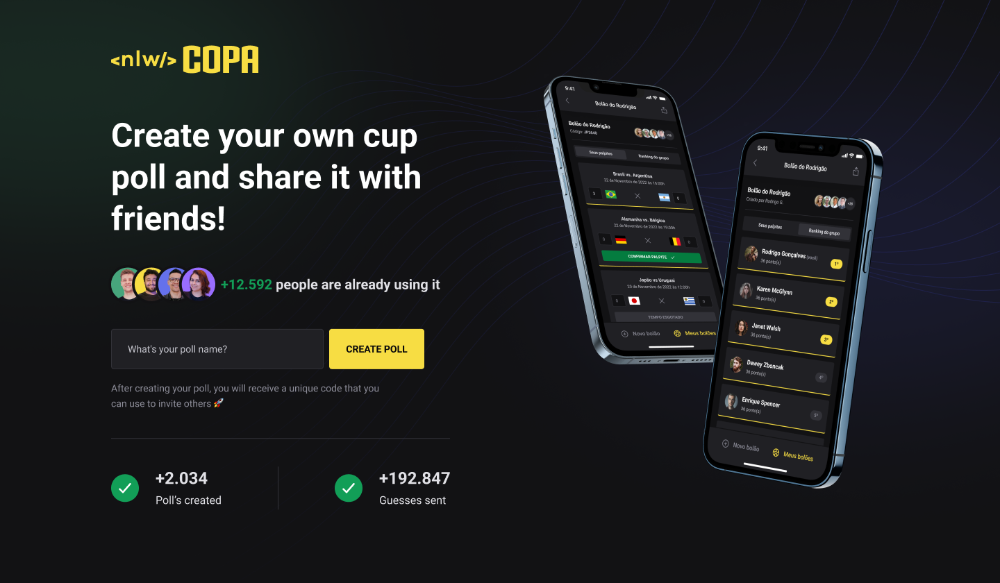

<p align="center">
  
</p>

<p align="center">
  
  <a href="LICENSE"></a>
  
</p>

<h1 align="center">
    
</h1>

## :rocket: Technologies

- [Node.js](https://nodejs.org/en/)
- [TypeScript](https://www.typescriptlang.org/)
- [Sqlite](https://github.com/mapbox/node-sqlite3)
- [Prisma](https://www.prisma.io/)
- [Diagrama ERD](https://www.npmjs.com/package/prisma-erd-generator/)
- [Fastify](https://www.fastify.io/docs/latest/Guides/Getting-Started/)
- [Zod](https://www.npmjs.com/package/zod)
- [ShorUniqueID](https://www.npmjs.com/package/short-unique-id)
- [Mermaid-js](https://mermaid-js.github.io/mermaid/#/)
- [Country Codes](https://countrycode.org/)

### 🎲 Running the backend (server)

```bash

# clone the repository
$ git clone https://github.com/sestevao/copa2022_ignite/server

# access project folder in terminal/cmd
$ cd copa2022_ignite

# go to server folder
$ cd server

# install the dependencies
$ npm install

# run the application in development mode
$ npm run dev

# the server will start on port:3333 - go to <http://localhost:3333>

```

### 🔭 Frontend

- [React](https://pt-br.reactjs.org/)
- [NextJS](https://nextjs.org/)
- [TypeScript](https://www.typescriptlang.org/)
- [Tailwindcss](https://tailwindcss.com/)
- [Axios](https://github.com/axios/axios)

```bash

$ git clone https://github.com/sestevao/copa2022_ignite/web
$ cd copa2022_ignite
$ cd web
$ npm install
$ npm run dev

# the server will start on port:3000 - go to <http://localhost:3000

```

### 📱 Mobile

- [Expo](https://expo.io/)
- [React Native](https://reactnative.dev/)
- [TypeScript](https://www.typescriptlang.org/)
- [React Native Svg-Transformer](https://github.com/kristerkari/react-native-svg-transformer)
- [Expo Auth Session](https://docs.expo.dev/versions/latest/sdk/auth-session/)
- [Expo Web Browser](https://docs.expo.dev/versions/v46.0.0/sdk/webbrowser/)
- [API GOOGLE](https://console.cloud.google.com)
- [PhosphorIcons](https://phosphoricons.com/)
- [Axios](https://www.npmjs.com/package/axios)
- [Country-List](https://www.npmjs.com/package/country-list)
- [DayJS](https://www.npmjs.com/package/dayjs)
- [dotENV](https://www.npmjs.com/package/dotenv)

```bash

$ git clone https://github.com/sestevao/copa2022_ignite/mobile
$ cd copa2022_ignite
$ cd mobile
$ npm install
$ npx expo start

```

## 💻 Project

NlwCopa is a project that aims to connect people who want to make pools with friends.

## 🔖 Layout

You can view the layout of the project in the format through [this link](<https://www.figma.com/file/GXHI2fST5PSNeSWGInYbAN/Bol%C3%A3o-da-Copa-(Community)>). Remembering that you will need to have an account at [Figma](http://figma.com/)

## 🤔 How to contribute

- Make a fork of this repository;
- Create a branch with your feature: `git checkout -b my-feature`;
- Commit your changes: `git commit -m 'feat: My new feature'`;
- Push to your branch: `git push origin my-feature`.

After your pull request is merged, you can delete your branch.

## 📝 License

This project is licensed under the MIT license. See the [LICENSE](LICENSE) file for more details.

---

<p align="center">
  Made with 💜 with Rocketseat
</p>

<p align="center">
  <a href="https://discord.gg/rocketseat">👉 Join our community 👈 </a> 
  PT 
</p>
