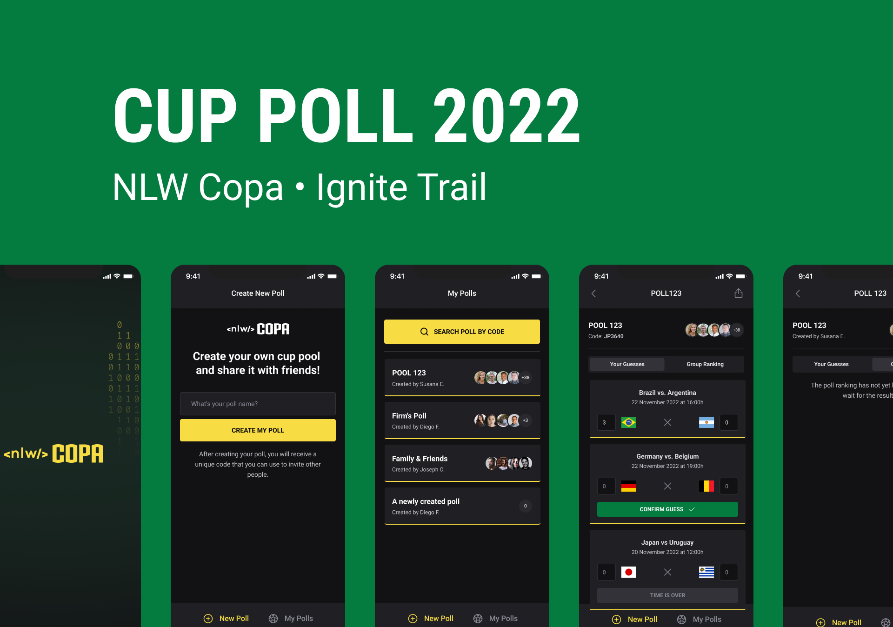

<h1 align="center">
    
</h1>

## :rocket: Technologies

- [Expo](https://expo.io/)
- [React Native](https://reactnative.dev/)
- [TypeScript](https://www.typescriptlang.org/)
- [React Native Svg-Transformer](https://github.com/kristerkari/react-native-svg-transformer)
- [Expo Auth Session](https://docs.expo.dev/versions/latest/sdk/auth-session/)
- [Expo Web Browser](https://docs.expo.dev/versions/v46.0.0/sdk/webbrowser/)
- [API GOOGLE](https://console.cloud.google.com)
- [PhosphorIcons](https://phosphoricons.com/)
- [Axios](https://www.npmjs.com/package/axios)
- [Country-List](https://www.npmjs.com/package/country-list)
- [DayJS](https://www.npmjs.com/package/dayjs)
- [dotENV](https://www.npmjs.com/package/dotenv)

## 🚀 How to run

**For this project to work correctly, the server must be running.**

- Install the packages with `npm install`.
- Create the app on google to access OAuth (<https://docs.expo.dev/guides/authentication/#google>)
- Copy the `.env.example` file to `.env` and fill it correctly.
- Change the address of the `src/services/api.ts` file, putting the machine's IP.
- Run `npm run dev` to start the Expo server.

## 📝 Notes

```bash
$ npx create-expo-app mobile
$ npx expo start
$ npm install native-base
$ npx expo install react-native-svg@12.1.1
$ expo install react-native-safe-area-context@3.3.2
$ npx expo install expo-font expo-google-fonts/roboto
$ npm i react-native-svg-transformer
$ npx expo install expo-auth-session expo-random
$ npx expo install expo-web-browser

# https://docs.expo.dev/guides/authentication/
# https://console.cloud.google.com

->  URIs (Authorized JavaScript origins): https://auth.expo.io
-> Authorized redirect URIs: https://auth.expo.io/@sestevao/nlwcopa2022

$ npm install --save phosphor-react-native
$ npx expo start --clear
```
