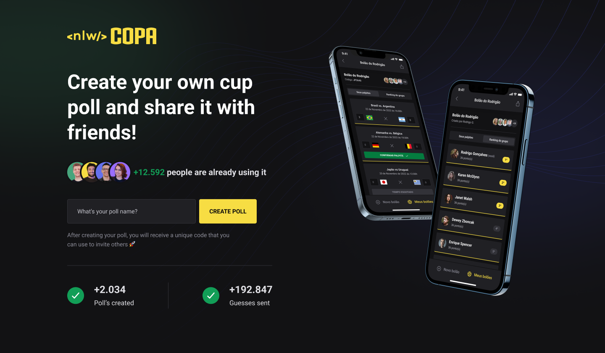

<h1 align="center">
    
</h1>

<br>

## :rocket: Technologies

- [React](https://pt-br.reactjs.org/)
- [NextJS](https://nextjs.org/)
- [TypeScript](https://www.typescriptlang.org/)
- [Tailwindcss](https://tailwindcss.com/)
- [Axios](https://github.com/axios/axios)

## 🚀 How to run

**For this project to work correctly, the server must be running.**

- Install the packages with `npm install`.
- Run `npm run dev` to start the web client.

## 📝 Notes

```bash
$ npx create-next-app@latest --use-npm
$ npm run dev
$ npm install -D tailwindcss postcss autoprefixer
$ npx tailwindcss init -p
```
